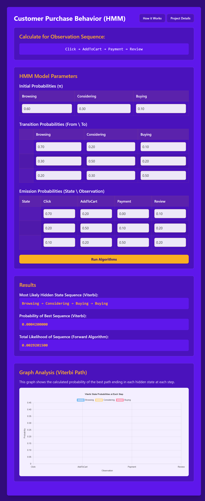

# 🛒 Customer Purchase Behavior Analysis using Hidden Markov Models (HMM)

## 📝 Project Overview

This project implements a web-based tool for analyzing customer behavior using a **Hidden Markov Model (HMM)**. The application allows users to define the initial, transition, and emission parameters of an HMM to model customer states (e.g., Browsing, Considering, Buying) based on observable actions (e.g., Click, AddToCart, Payment, Review).

The tool calculates and visualizes key HMM solutions, including the most likely sequence of hidden customer states for a given observation sequence.

---

## 📸 Application Screenshot

---

## ✨ Key Features

* **Custom Parameter Input:** Easily input and modify HMM parameters:
    * **Initial Probabilities ($\pi$)**: Browsing, Considering, Buying.
    * **Transition Probabilities ($A$)**: Probability of moving between hidden states.
    * **Emission Probabilities ($B$)**: Probability of observing an action given a hidden state.
* **Viterbi Algorithm:** Calculates the **Most Likely Hidden State Sequence** (the path the customer took) for a given sequence of actions.
* **Forward Algorithm:** Calculates the **Total Likelihood** of observing the action sequence.
* **Graph Visualization:** Provides a graph analysis of the Viterbi path, showing the calculated probability distribution over hidden states at each step.

## 🚀 Getting Started

Follow these steps to get your local copy up and running.

### Prerequisites

* Python 3.x
* Git (for cloning the repository)

## ⚙️ HMM Model Details

The application models three **Hidden States** and four **Observable Actions**:

| Type | Hidden States | Observable Actions |
| :--- | :--- | :--- |
| **States** | Browsing, Considering, Buying | |
| **Observations**| | Click, AddToCart, Payment, Review |

### HMM Equations (Conceptual)

The core logic is implemented using the following algorithms:

* **Viterbi Algorithm:** Used to find the optimal sequence of hidden states $\mathbf{q}^* = (q_1^*, q_2^*, \ldots, q_T^*)$ that maximizes $P(\mathbf{q} | \mathbf{O}, \lambda)$.
* **Forward Algorithm:** Used to calculate the probability of the observed sequence $\mathbf{O} = (o_1, o_2, \ldots, o_T)$ given the model $\lambda$: $P(\mathbf{O} | \lambda)$.

---

## 🛠️ Technology Stack

* **Backend:** Python, Django
* **HMM Implementation:** Custom Python/NumPy (Likely)
* **Frontend:** HTML, CSS, JavaScript (for graph rendering)

---

## 🤝 Contribution

Contributions are welcome! If you have suggestions for new features, bug fixes, or performance improvements, please feel free to:

1.  Fork the repository.
2.  Create your feature branch (`git checkout -b feature/AmazingFeature`).
3.  Commit your changes (`git commit -m 'Add some AmazingFeature'`).
4.  Push to the branch (`git push origin feature/AmazingFeature`).
5.  Open a Pull Request.

---
